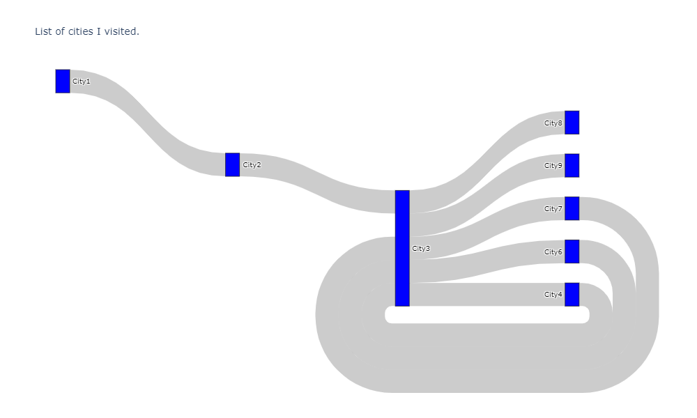
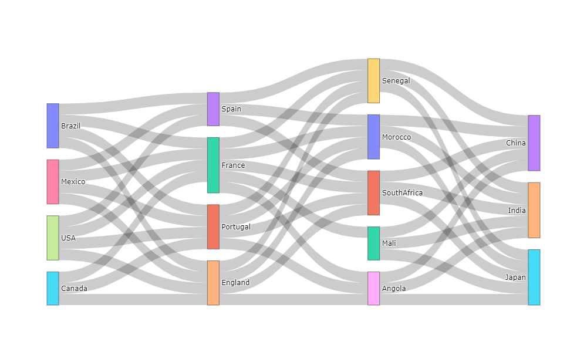
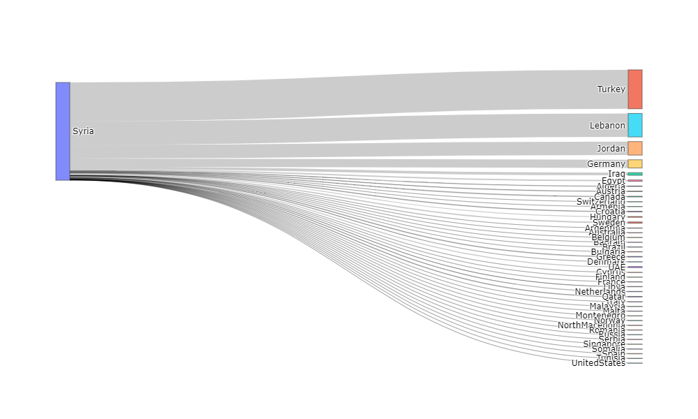

# Creating Sankey diagram with 3 different data


```python
import json, urllib
import chart_studio.plotly as py
import pandas as pd
import numpy as np
from plotly.offline import download_plotlyjs, init_notebook_mode, plot, iplot
```

## List of cities I visited.


```python
import plotly.graph_objects as go

fig = go.Figure(data=[go.Sankey(
    node = dict(
      pad = 15,
      thickness = 20,
      line = dict(color = "black", width = 0.5),
      label = ["City1", "City2", "City3", "City4", "City6","City7","City8","City9"],
      color = "blue"
    ),
    link = dict(
      source = [0,1,2,3,2,4,2,5,2,2], # indices correspond to labels, eg A1, A2, A1, B1, ...
      target = [1,2,3,2,4,2,5,2,6,7],
      value =  [1,1,1,1,1,1,1,1,1,1]
  ))])

fig.update_layout(title_text="List of cities I visited.", font_size=10)
plot(fig,
     image_filename='sankey_plot_1', 
     image='png', 
     image_width=1000, 
     image_height=600
)
fig.show()
```



##  Sankey from csv


```python
df = pd.read_csv ('ulkes.csv')
df
```


```python
c=df
del c["Value"]
```


```python
c=c.values

```


```python
node_label=[]
for i in c:
    for ii in i:
        if ii not in node_label:
            node_label.append(ii)
        
```


```python
node_label
```


```python
#node_label = ["A1", "A2", "B1", "B2","B3", "C1", "C2"]
node_dict = {y:x for x, y in enumerate(node_label)}
node_dict
# {'A1': 0, 'A2': 1, 'B1': 2, 'B2': 3, 'B3': 4, 'C1': 5, 'C2': 6}
```


```python

df = pd.read_csv ('ulkes.csv')

source = df["Source"]
target = df["Target"]
values = df["Value"]
source_node = [node_dict[x] for x in source]
target_node = [node_dict[x] for x in target]

```


```python
import plotly.graph_objects as go # Import the graphical object

fig = go.Figure( 
    data=[go.Sankey( # The plot we are interest
        # This part is for the node information
        node = dict( 
            label = node_label
        ),
        # This part is for the link information
        link = dict(
            source = source_node,
            target = target_node,
            value = values
        ))])

# With this save the plots 
plot(fig,
     image_filename='sankey_plot_1', 
     image='png', 
     image_width=1000, 
     image_height=600
)
# And shows the plot
fig.show()
```



## Display of Syrian refugee numbers with Sankey diagram


```python
df = pd.read_csv ('suria.csv')
df
```


```python
c=df
del c["Value"]
c=c.values
node_label=[]
for i in c:
    for ii in i:
        if ii not in node_label:
            node_label.append(ii)
node_label
```


```python
node_dict = {y:x for x, y in enumerate(node_label)}
node_dict
```


```python
from plotly.offline import download_plotlyjs, init_notebook_mode, plot, iplot
df = pd.read_csv ('suria.csv')

source = df["Source"]
target = df["Target"]
values = df["Value"]
source_node = [node_dict[x] for x in source]
target_node = [node_dict[x] for x in target]

```


```python
import plotly.graph_objects as go 

fig = go.Figure( 
    data=[go.Sankey(
        node = dict( 
            label = node_label
        ),
     
        link = dict(
            source = source_node,
            target = target_node,
            value = values
        ))])


plot(fig,
     image_filename='sankey_plot_1', 
     image='png', 
     image_width=1000, 
     image_height=600
)
# And shows the plot
fig.show()
```




 Markup : 1. A numbered list
              1. A nested numbered list
              2. Which is numbered
          2. Which is numbered
