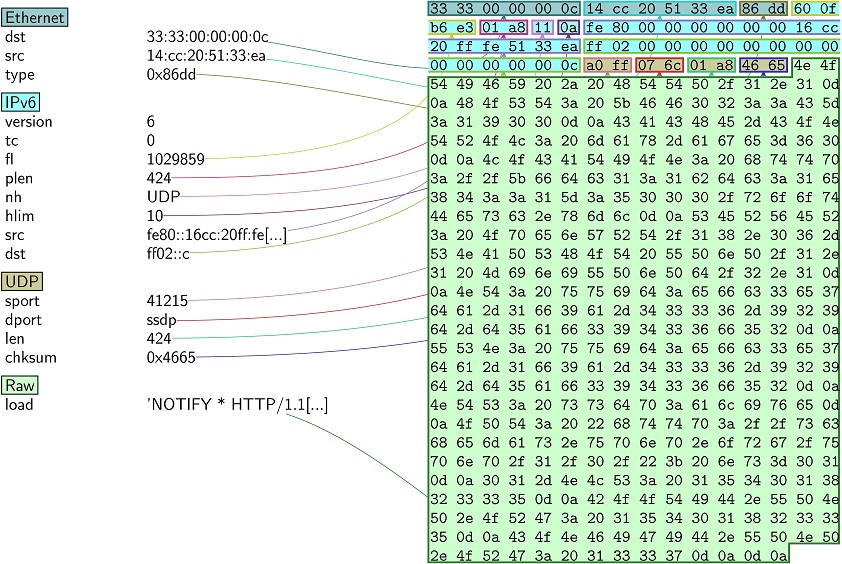

## Showing the byte-feature distribution of network packets which is  in a PCAP file with Sankey diagram

```python
from scapy.all import*
import math
import pandas as pd
import os
import numpy as np
```


```python

pkt = rdpcap("x.pcap")
```


```python
pkt[123].pdfdump("1.pdf")
```

    
    


